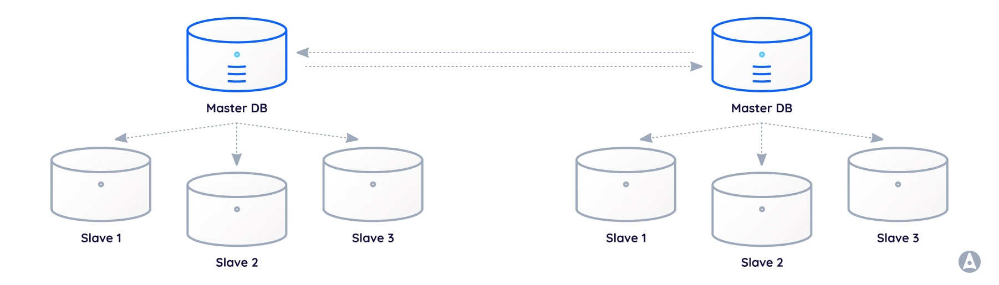
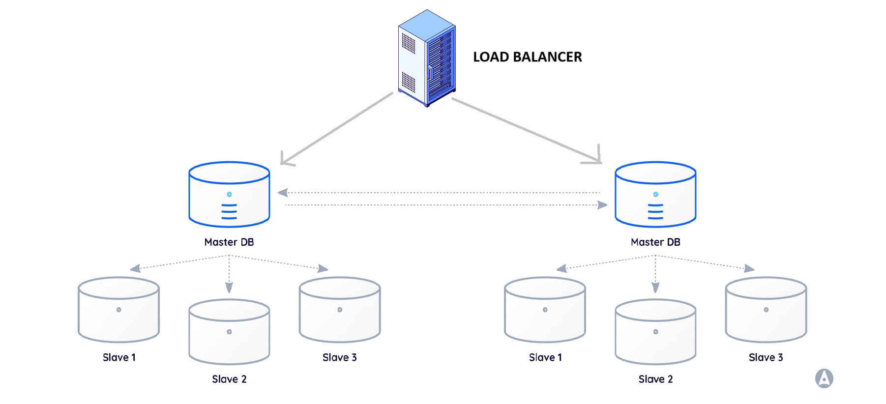
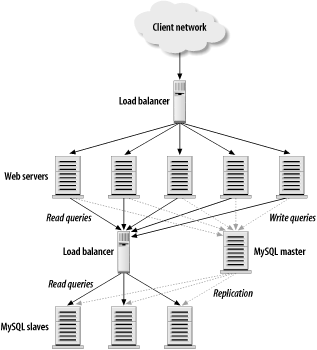
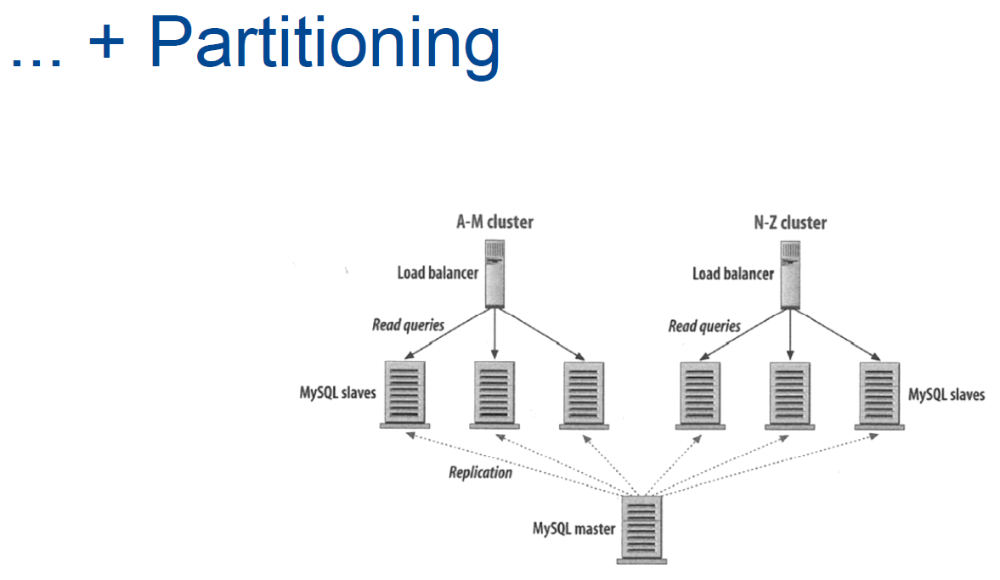
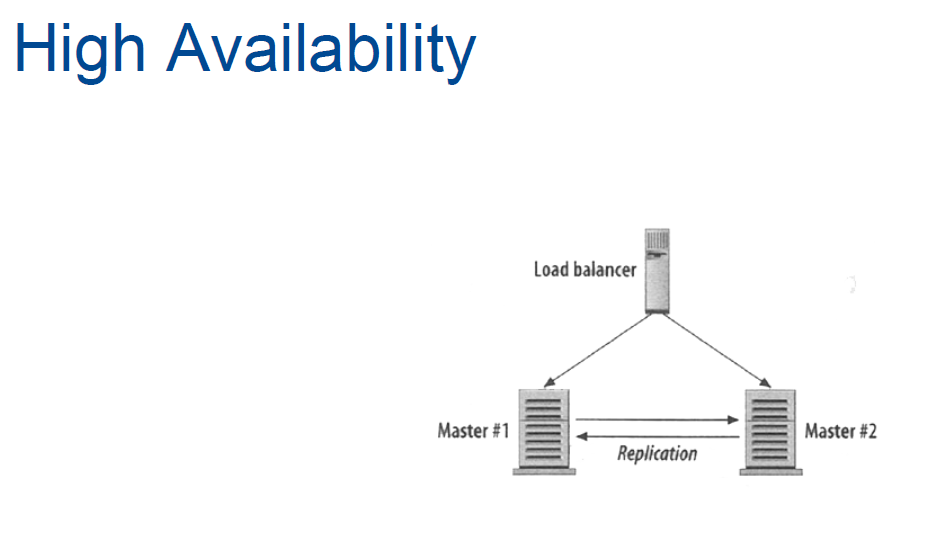

[Hardvard 2012 CS75 Lecture 9 Youtube Video Summarized](https://www.chaindesk.ai/tools/youtube-summarizer/cs-75-summer-2012-lecture-9-scalability-harvard-web-development-david-malan--W9F__D3oY4)

[Hardvard 2012 CS75 Lecture 9 PDF](https://cdn.cs75.net/2012/summer/lectures/9/lecture9.pdf)

### A. Features a Web Hosting Provider Should Provide

1. **Availability**
2. **SFTP instead of FTP**
   - Use SFTP to ensure username/password traffic is encrypted.
3. **Geographical Accessibility**
   - Ensure the provider is not blocked in certain countries (e.g., if a country like China blocks GoDaddy, then the website can't be accessed by users in China).
4. **Avoid Shared Web Hosting**

   - Shared hosting means you don't have access to the machine. Opt for VPS (Virtual Private Server). For example, EC2 is a VPS.

5. VPS (Virtual Private Server)

- You get a copy of the OS with more controls. It is a slice of a large machine, which is divided into multiple virtual computers via software like Hypervisor.
- **Difference from Shared Web Hosting:** With VPS, you have access to a machine where no other users have accounts.

# B. Scaling

### 1. Vertical Scaling

- CPU

  - **Single Core, Dual Core, Quad Core, Hyperthreading**

    - Number of instructions that can be performed at once:
    - Quad Core means 4 instructions.
    - Hyperthreading means one core can be split into 4 or more threads and can perform multiple instructions simultaneously.

- **L1, L2, L3 Cache**

  - Cache memory acts as a buffer between the CPU and the main memory (RAM), speeding up data access.
  - **L1 Cache**: Closest to the CPU, hence the fastest.
  - **L2 Cache**: Larger than L1 but slower.
  - **L3 Cache**: Largest cache, usually slower than L1 and L2.

- Disk

  - **PATA, SATA, SAS**

    Mechanical hard drives: SATA is common for desktops (3.5 inch) and laptops (2.5 inch) and spins at 7200 RPM. SAS spins at 15000 RPM.

  - **SSD**

    Electronic hard drive, faster than mechanical drives as it has no moving parts. Costly.

  - **RAID** (Redundant Array of Independent Disks)

    RAID is a type of storage that writes data across multiple drives within the same system. So that one or more hard drives can fail and still there wont be any data loss. Later we can replace the faulty one with a new hard drive and then we can have redundance again (it will automatically create a redundant copy). [Video from 35:37](https://youtu.be/-W9F__D3oY4?t=2137)

- RAM

## Horizontal Scaling

Instead of buying top-notch expensive machines, buy more cheaper machines and distribute the load among them.

  
   

- ### Advantages of a load balancer :

  - only the load balancer's IP need to be public, the server1, server2 etc IP addresses can be private.

  - This helps since IPv4 are exhausting.

  - Also, more secure since now people cant get direct access to server1.

  - We can decide on how to distribute load between our servers. Few strategies to do load balancing are :
    - Round robin (based on luck , a single server can get bombarded , not good)
    - Based on load
    - Other user related heuristics

- ### Shared Session storage

  - Now since we have a load balancer and we want to distribute load across multiple servers , we would like all the session state data to be stored in a single server location and not in server's memory , coz the next request might not hit the same server. So session data needs to be stored in shared storage.

  Possible storage options :

  - MySQL (will need replication coz single point of failure)
  - Cookies (if data is small) , also user can disable cookies on a site

    Store a random number in the cookie which the load balancer will translate into server1's IP address for the 2nd 3rd and nth request.

### Caching

- #### Cache Code on the server :

  One can increase performance by caching compiled code (so that the compilation process happens only once).

  - For JAVA, store the byte code on the server rather than source code (.java files)
  - For Python, store .pyc files rather than .py files
  - For PHP, similar performance accelerators are available.

- #### MYSQL Query Cache

  Enable via my.cnf file, so that queries can be cached

- #### Memcache
  Cache data in RAM or a Redis Server so that we dont have to query the DB. (LRU caching Least Recently Used is a very common strategy)

### Replication

- DB Replication

  Every write query which master receives is replicated across to slaves also

- ### Master Slave Replication :

  

- 1.  Any slave can become a master when master fails
- 2.  We can do all reads via read slaves, all writes go through master

- Problem : Single point of failure if master dies (promoting a slave may take time)

- ### Master Master Replication :

  

- Now we need communication between Master & Master. So we need a load balancer to distribute traffice between them

  

- Our current topology looks like this :

  

- We still have 2 load balancers in the above diagram, each of which are single point of failures 😒

- So we can add 2 load balancers for DB stuff , 2 load balancers for web-server stuff (total 4).

- Load balancers can run in 2 modes :

  In both these modes , they continuously check each others heartbeat.

  - #### Active-Active :
    Load is distributed between both load balancers and if one active dies , the other active assumes full control.
  - #### Active-Passive :
    Load is on only the active one and and if active one dies , the passive assumes the IP address of the dead machine and becomes the active one.

- Partioning :

  

- High Availability :

  

- Geography based load balancing :

  us-east-1 , us-east-2, ap-south-1 (Data centers across the world) etc

- Security : Follow "Principle of Least Privilidge" (Firewall)

  - Allow only ports like TCP:22, TCP:80, TCP:443 as incoming on web servers
  - Allow only TCP:80 from load balancer to web server
  - Allow only ports like TCP:3306 incoming on MySQL servers
